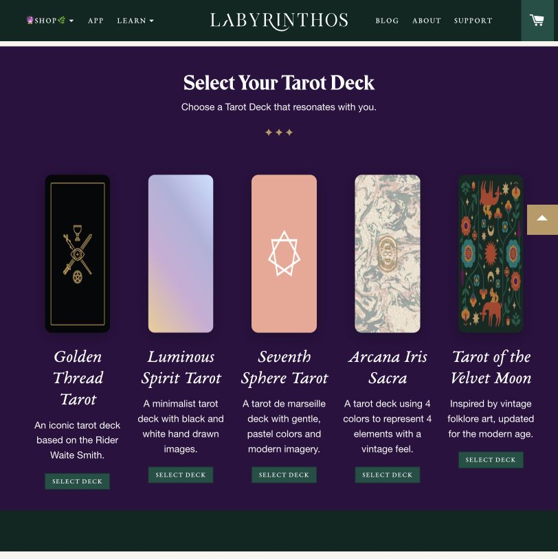
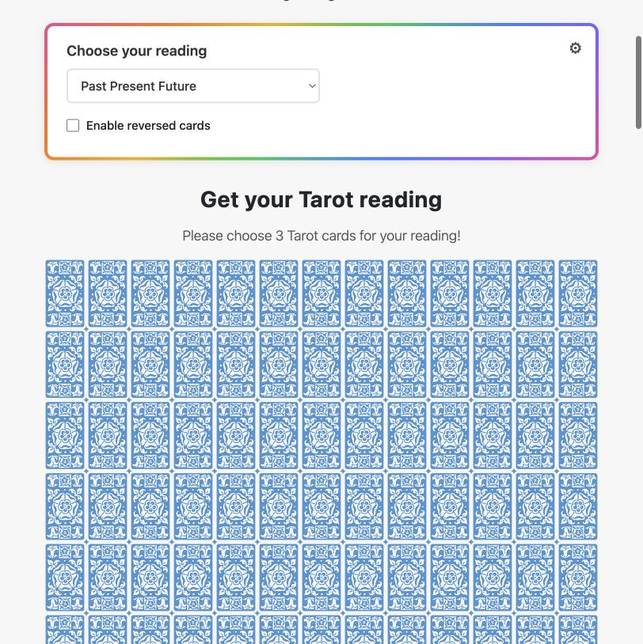
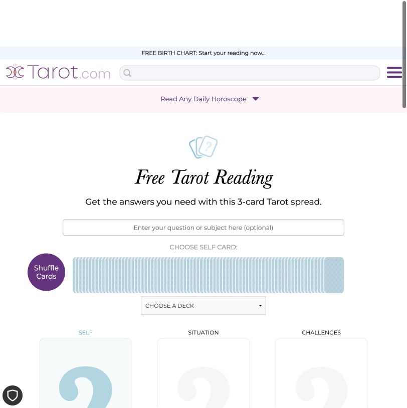
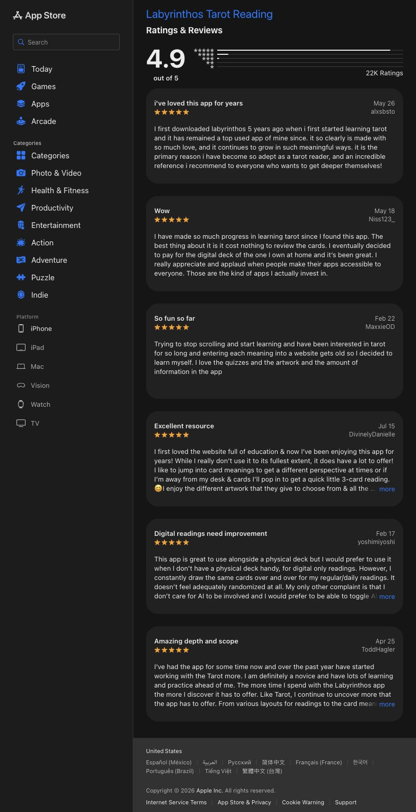

# Трёхкарточный расклад: практика, структура и выводы для Mora

Дата исследования: 2026-07-31.

## Короткий ответ

Единого обязательного канона, по которому все тарологи объясняют три карты, нет. Есть устойчивый профессиональный каркас:

1. До вытягивания формулируется вопрос и назначается функция каждой позиции.
2. Каждая карта читается не по словарному значению, а как ответ своей позиции.
3. Проверяются связи: движение слева направо, контрасты, повторяющиеся масти/числа, преобладание Старших арканов, направление фигур и общий эмоциональный тон.
4. Три карты собираются в одну причинно-следственную историю.
5. Итог возвращает человека к вопросу и оставляет ему выбор или следующий шаг, а не объявляет неизбежный приговор.

Именно синтез отличает чтение от трёх независимых карточных справок. В курсе Joan Bunning финальная интерпретация описывается как создание единой tarot story; Llewellyn называет spread «storyboard», где позиция задаёт контекст карте, а порядок позиций — логику истории.

Источники: [Joan Bunning — Creating the Story](https://www.learntarot.com/less18.htm), [Llewellyn — Spreadcrafting](https://www.llewellyn.com/journal/print.php?id=2355), [Llewellyn — Three-Card Readings](https://www.llewellyn.com/blog/2010/05/three-card-readings/), [АСТ — трёхкарточные расклады](https://ast.ru/news/trekhkartochnye-rasklady-taro-dlya-nachinayushchikh/).

## Что происходит в живом чтении

Практика варьируется, но типичная консультация выглядит так:

1. **Договор о вопросе.** Таролог уточняет не только тему («отношения»), но и задачу: понять динамику, препятствие, возможный следующий шаг. Чем точнее вопрос, тем меньше универсальных формулировок.
2. **Обозначение схемы.** Например: ситуация → что требует внимания → доступная опора; или прошлое → настоящее → вероятное направление. Роли нельзя молча придумывать после выпадения карт: это создаёт возможность подогнать ответ.
3. **Первое впечатление.** Опытный читатель часто сначала отмечает общий рисунок: много ли Старших арканов, какая масть доминирует, есть ли резкий контраст, куда смотрят персонажи.
4. **Карты по очереди.** Для каждой карты называют видимую сцену, её базовую тему и то, как эта тема отвечает позиции и вопросу.
5. **Связки.** Первая карта обычно задаёт состояние или причину; вторая меняет, осложняет или объясняет её; третья показывает развитие, ресурс или результат. Это грамматика конкретного spread, а не универсальная «магия цифры три».
6. **Синтез.** Читатель отвечает одним связным тезисом: что происходит, почему и куда направить внимание.
7. **Возврат человеку агентности.** Хороший финал говорит о тенденции и выборе, а не «так обязательно случится».

Вариант без назначенных позиций тоже существует: три карты читают как одну сцену или предложение. Но для цифрового продукта он хуже воспроизводим и сложнее проверяется. Даже обучающие материалы Llewellyn подчёркивают, что простой расклад почти бессмысленен без функции каждой карты.

Источник: [Llewellyn — The Meadow Tarot Spread](https://www.llewellyn.com/journal/article/3170).

## Есть ли правильный порядок рассказа

В живом чтении чаще принят порядок «карты по одной → общий вывод», потому что человек наблюдает, как мысль собирается в реальном времени. Но для продукта полезен гибрид:

1. **Короткая главная линия — 1–2 предложения.** Не полный вердикт, а ориентир: где находится напряжение или поворот.
2. **Первая карта — исходное состояние.** Сцена → смысл → связь с вопросом.
3. **Вторая карта — изменение или узел.** Обязательно объяснить, как она продолжает или спорит с первой.
4. **Третья карта — опора или направление.** Обязательно ответить на первые две, а не начать третью мини-историю.
5. **Итог — одна собранная линия и один вопрос/следующий шаг.** Без пересказа трёх абзацев.

Таким образом, текущая пятичастная архитектура Mora — overview → три карты → conclusion — в целом верна. Риск не в порядке, а в том, что overview может превратиться в преждевременный универсальный вывод, а карточные секции — в три словарные статьи.

## Как сделать чтение системным

Для каждой карты нужен не готовый текст, а один и тот же интерпретационный проход.

### Слой 1. Наблюдение

- Какие 2–4 детали действительно видны в сцене Rider–Waite–Smith?
- Куда направлены фигуры и действие?
- Сцена статична, строится, рушится, движется, закрывается?

### Слой 2. Базовая тема

- Архетип карты.
- Масть: Жезлы — импульс/действие; Кубки — чувства/связь; Мечи — мысль/конфликт; Пентакли — материальное, тело, практика.
- Число или ранг как дополнительный паттерн, а не автоматический приговор.

### Слой 3. Функция позиции

Одна карта должна звучать по-разному в позиции причины, препятствия, ресурса или направления. Например, Тройка Мечей в прошлом — пережитая боль, влияющая на настоящее; в позиции страха — ожидание повторного ранения.

### Слой 4. Контекст вопроса

«Совместная работа» Тройки Пентаклей в карьере может быть командным проектом, а в отношениях — готовностью двоих строить связь действиями. Это не разные словари, а перенос одного смыслового ядра в разные области.

### Слой 5. Отношение к соседям

Для пары соседних карт полезны четыре проверяемых связи:

- **продолжение:** вторая карта развивает первую;
- **контраст:** две карты тянут в разные стороны;
- **причина → следствие:** первая объясняет вторую;
- **проблема → коррекция:** следующая карта предлагает иной способ действия.

Дополнительно можно учитывать повтор мастей, номера, долю Старших арканов и направление персонажей. Но эти признаки должны уточнять основной рассказ, а не порождать отдельную энциклопедию сочетаний.

### Слой 6. Синтез

Формула итогового тезиса:

> Сейчас **[состояние из карты 1]**, но ключевое напряжение находится в **[карта 2 и её связь с первой]**. Карта 3 показывает не гарантированный исход, а **[доступная опора / вероятное направление]**.

## Можно ли вытаскивать эмоцию

Да, но эмоциональный удар должен следовать из структуры расклада.

Рабочие сигналы:

- карта резко противоречит своей позиции: «Солнце» в препятствии, «Башня» в ресурсе;
- вторая карта переворачивает тон первой;
- третья неожиданно разрешает или усиливает конфликт первых двух;
- повторяется одна масть или число;
- выпадает несколько Старших арканов;
- персонажи визуально отвернулись друг от друга или, наоборот, образуют одну сцену.

Допустимая живая реакция:

> «Вот здесь расклад меняет тон: Тройка Пентаклей стоит не в результате, а в препятствии. Проблема не в отсутствии способностей, а в том, что работу приходится согласовывать — или слишком долго ждать чужого одобрения».

Плохая реакция:

> «О, Тройка Пентаклей — это не к добру».

Последняя фраза эмоциональна, но канонически неточна: прямую Тройку Пентаклей обычно связывают с мастерством, сотрудничеством и признанием работы. Негатив появляется из позиции, перевёрнутости или соседей, а не из названия карты.

Источники: [Joan Bunning — Three of Pentacles](https://www.learntarot.com/p3.htm), [Llewellyn — направление фигур и поток между картами](https://www.llewellyn.com/blog/2010/05/three-card-readings/).

## Тон сложных карт

Этика профессионального чтения не требует превращать все карты в позитив. Она требует честности без запугивания:

- назвать трудную тему прямо;
- отделить символическую возможность от факта;
- не предсказывать смерть, болезнь, катастрофу или неизбежное расставание;
- не отнимать выбор;
- завершить опорой, действием или вопросом, а не тревогой.

Например: «Эта карта показывает риск конфликта» вместо «вас предадут»; «здесь может завершаться прежний формат отношений» вместо «вы точно расстанетесь».

Это совпадает с кодексами профессиональных сообществ: International Tarot Foundation требует избегать fear-based language и absolute outcomes; Biddy Tarot формулирует роль этичного читателя как помощь человеку услышать собственное решение, а не указание, что делать.

Источники: [International Tarot Foundation — Code of Ethics](https://www.internationaltarotfoundation.com/code-of-ethics), [Biddy Tarot — Ethics](https://biddytarot.com/blog/the-ethics-of-tarot-reading/), [Tarosophy Code](https://www.tarotassociation.net/legal/TarosophyCode.pdf).

## Конкуренты

| Продукт | Что делает хорошо | Где слабее | Урок для Mora |
|---|---|---|---|
| Labyrinthos | Красивые колоды, много spread-схем, обучение, справочник, заметки; пользователь чувствует, что осваивает систему | В отзывах критикуют повтор карт и навязанный AI; часть AI-трактовок воспринимается как слишком общая | Объяснять логику чтения, сохранять доверие к случайности, не прятать связь карт за «AI сказал» |
| Trusted Tarot | Сразу показывает множество понятных схем; роли трёх позиций сформулированы до выбора карт; выбор из всей колоды создаёт ощущение участия | Экран перегружен, 78 одинаковых рубашек выглядят как таблица; сильные обещания «accurate answers» и ритуал защиты могут снижать доверие светской аудитории | Оставить ясность позиций, но сохранить ритуальную простоту Mora и избегать обещания точного будущего |
| Tarot.com | Удачная схема Self → Situation → Challenges/Opportunities; видимая колода и последовательный выбор; объясняет назначение каждой позиции | Во время проверенного сценария показал строку `Please choose null more card`; результат закрывается обязательной регистрацией после выбора, что ломает кульминацию | Можно предложить сохранение после ценности, но нельзя удерживать уже созданный расклад заложником auth-wall |
| Faladdin | Сильная персональная интонация, ожидание «письма от таролога», высокая эмоциональность | Предсказательность и повторяющиеся обещания снижают доверие: в отзыве пользователь пишет, что приложение снова и снова обещало встречу с новым мужчиной, но ничего не произошло | Брать ощущение личного обращения, не брать конкретные пророчества и ложную уверенность |
| Nebula | Человеческий чат и ощущение «меня видят»; широкая воронка из astrology/self-discovery | Агрессивная монетизация и marketplace психиков порождают жалобы на upsell и общие ответы | North Star Mora — диалог — сильный, но доверие важнее минуты платного чата |

### Скриншоты

### Показательные отзывы

Labyrinthos, App Store:

> “It is the primary reason I have become so adept as a tarot reader.”

Сильная сторона — продукт не только выдаёт ответ, но и повышает компетентность пользователя.

Другой отзыв жалуется на постоянное повторение одинаковых карт и ощущение недостаточной случайности. Даже корректная случайность не помогает, если она не выглядит случайной: недоверие к тасовке разрушает доверие ко всему чтению. Там же пользователь просит возможность полностью отключить AI — модель сама по себе не воспринимается как ценность, если tarot-логика остаётся непрозрачной.

Faladdin, App Store:

> “Pretty much every time it said that I was going to meet someone new, a guy.”

Повторяющееся желаемое предсказание сначала создаёт эмоцию, затем уничтожает доверие.

Источники отзывов: [Labyrinthos — App Store Ratings & Reviews](https://apps.apple.com/us/app/labyrinthos-tarot-reading/id1155180220?platform=iphone&see-all=reviews), [Faladdin — App Store](https://apps.apple.com/gb/app/faladdin-tarot-horoscopes/id1201725025).

## Рекомендованный контракт Mora

### Позиции общего трёхкарточного расклада

Для универсальной темы лучше не использовать «прошлое → настоящее → будущее»: она толкает модель к пророчеству и плохо работает для вопроса без временной оси.

Более сильная базовая схема:

1. **Сейчас** — что происходит в выбранной теме.
2. **Что мешает** — где находится основное препятствие.
3. **Что делать** — что можно сделать дальше.

Это рабочая редакционная схема Mora, основанная на распространённом варианте `Current situation / Obstacle / Advice`. Единого канонического набора позиций для трёх карт нет; формулировки Mora временные и могут уточняться после проверки полного flow.

### Контракт каждой персональной секции

Перед содержанием секция явно показывает тему расклада, номер этапа, название позиции и её функцию. Название карты само по себе не объясняет роль главы.

1. Назвать 2–3 реальные детали изображения.
2. Объяснить их традиционный смысл.
3. Связать смысл с вопросом и конкретной позицией.
4. Одним предложением связать карту с предыдущей.
5. Не утверждать мысли или действия третьего лица как факт.

Рекомендуемая UI-иерархия: `Расклад · [тема]` → `[номер этапа] · [Общий рисунок / Сейчас / Что мешает / Что делать / Итог]` → `[название карты, если это персональная секция]` → `[функция позиции]` → два абзаца чтения.

### Контракт общего вывода

- один главный тезис;
- одна связь между всеми тремя картами;
- один честный риск или напряжение;
- одна доступная опора;
- один открытый вопрос или следующий шаг;
- никаких новых символов и значений, которых не было в персональных секциях.

## Главный продуктовый вывод

Mora не должна соревноваться количеством spread-схем. Её отличие может быть в ощущении живого сильного таролога: сначала заметить конкретную сцену, затем показать, почему соседняя карта меняет её смысл, и только после этого дать связный вывод. Эмоция нужна, но её источник — обнаруженная связь между картами, а не театральный испуг перед «плохим» арканом.
